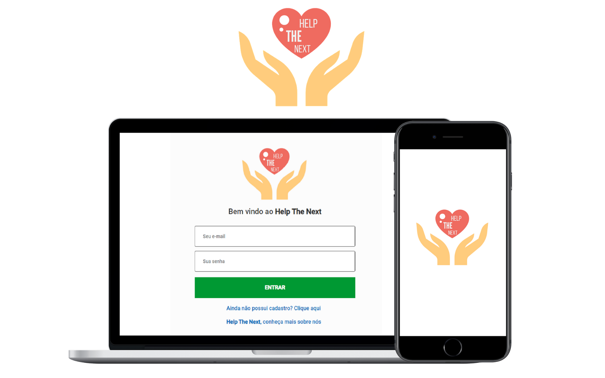
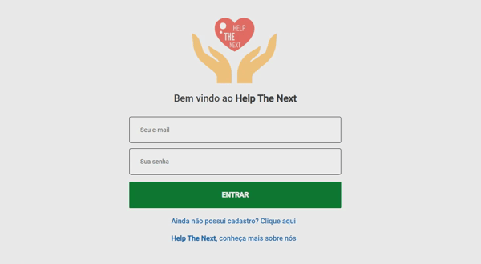

---

<h1 align="center">
  Help The Next
</h1>

  

<h1 align="center">
    
    
</h1>

## Objectives :pushpin: 
The main objective of the project was to learn a little more about the use of Stack JavaScript (Node.js, Reactjs and React Native), in addition to producing a simple application to help institutions that need support.

## Technologies :desktop_computer:

The main technologies used in the project were:

<ul>
    <li><a href="https://nodejs.org/en/">Node.js</a></li>
    <li><a href="https://reactjs.org/">ReactJS</a></li>
    <li><a href="https://reactnative.dev/">React Native</a></li>
    <li><a href="https://expo.io/">Expo</a></li>
</ul>

And as tools in development:

<ul>
    <li><a href="https://code.visualstudio.com/">Visual Studio Code</a></li>
    <li><a href="https://insomnia.rest/">Insomnia</a></li>
    <li><a href="https://github.com/arb/celebrate">Celebrate</a></li>
    <li><a href="http://knexjs.org/">Knex</a></li>
</ul>

## Tests :white_check_mark:

To test the project locally, follow these steps:

- Click <a href="https://github.com/rodrigoge/help-the-next.git">here</a> to download the project
- Open the project folder using Visual Studio Code
- Install project dependencies at the root: `npm install`.
- To execute all parts of the project, enter the backend, frontend and mobile folders and use the command: `npm start`.

## How to contribute 🤔

- Fork this repository;
- Create a branch with your feature: `git checkout -b minha-feature`;
- Commit your changes: `git commit -m 'feat: Minha nova feature'`;
- Push to your branch: `git push origin minha-feature`.

## License :memo:

This system is being developed under license from MIT. For more information, <a href="LICENSE">click here</a>.

---
